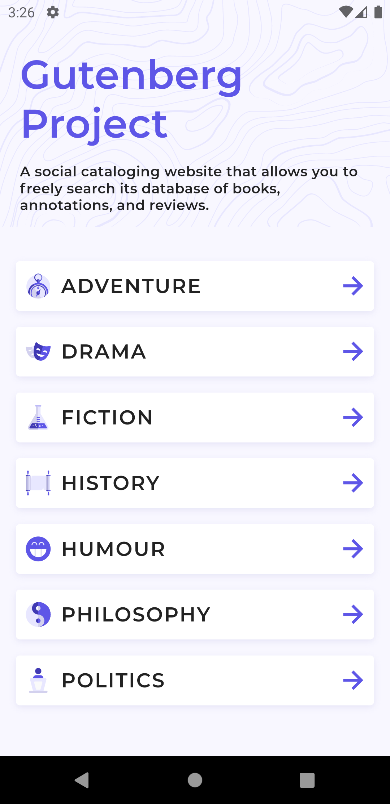

# gutenberg

# Plugins
flutter-svg 
http 
flutter_bloc 
url_launcher 
equatable

# Following
Single Responsibility  Principle  
Sepreation of concern  
Singleton pattern  
Repository and Service architecture  
Bloc for state management  
Clean architecture using doamin, data, presentation  
Composition over inheritance 

# Screenshots

